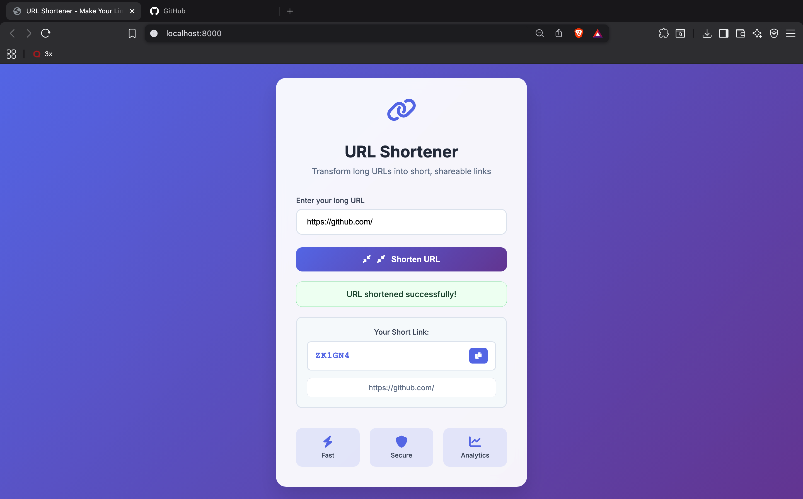

# Serverless URL Shortener

<p align="center">
  
  
</p>

A production-ready, serverless URL shortener built on AWS with Infrastructure as Code. This project demonstrates modern cloud architecture, event-driven design, and automated CI/CD practices.

## Overview

This URL shortener leverages AWS serverless services to provide a scalable, cost-effective solution for shortening and tracking URLs. The architecture uses API Gateway HTTP API for request handling, AWS Lambda for serverless compute, and DynamoDB for storage - all managed through Terraform.

## Architecture

**API Layer**
- AWS API Gateway HTTP API v2 with proxy integration
- RESTful endpoints for URL operations
- CORS-enabled for web client support

**Compute Layer**  
- Python 3.11 Lambda functions
- Shortener: Generates unique 6-character codes with collision detection
- Redirect: Handles URL lookups and click tracking

**Data Layer**
- Amazon DynamoDB on-demand table
- Consistent reads for data integrity
- Automatic scaling based on traffic

**Infrastructure**
- Terraform for Infrastructure as Code
- GitHub Actions for automated CI/CD
- AWS OIDC for secure credential management
- Least-privilege IAM roles per function

## Tech Stack

**Infrastructure:** Terraform, GitHub Actions, AWS OIDC  
**Compute:** AWS Lambda (Python 3.11)  
**API:** API Gateway HTTP API v2  
**Database:** DynamoDB (On-Demand)  
**Frontend:** HTML5, JavaScript (Vanilla)  

## Key Features

**URL Shortening**
- Generates unique 6-character alphanumeric codes
- DynamoDB condition expressions prevent collisions
- Validates HTTP/HTTPS URLs before processing

**Click Tracking**
- Automatic click counter increment
- Last accessed timestamp updates
- Ready for analytics integration

**Security**
- Security headers on all responses
- Input validation and sanitization
- Least-privilege IAM policies
- AWS OIDC for CI/CD (no hardcoded credentials)

**Infrastructure as Code**
- Complete Terraform configuration
- Automated deployment pipeline
- Environment-specific resource tagging

## API Endpoints

**POST /shorten**
- Accepts: `{"long_url": "https://example.com"}`
- Returns: `{"short_code": "ABC123"}`
- Validates URL format and generates collision-safe codes

**GET /r/{code}**
- Accepts 6-character code
- Returns HTTP 302 redirect to original URL
- Updates click count and last accessed timestamp

## Project Structure

```
ServerlessURLShortener/
├── infra/                    # Infrastructure as Code
│   ├── main.tf              # AWS resources
│   ├── providers.tf         # AWS provider config
│   ├── variables.tf         # Input variables
│   ├── outputs.tf           # Output values
│   └── lambda/              # Lambda function code
│       ├── shortener/       # URL shortening logic
│       └── redirect/        # URL redirection logic
├── frontWeb/                 # Frontend application
│   ├── index.html           # User interface
│   └── app.js               # Client-side logic
└── .github/workflows/       # CI/CD pipeline
    └── deploy.yml           # GitHub Actions workflow
```

## Getting Started

**Prerequisites**
- AWS CLI configured with credentials
- Terraform >= 1.6.0
- Python 3.11+ for local development

**Local Deployment**
```bash
cd infra
terraform init
terraform validate
terraform apply
terraform output -raw http_api_url
```

**Frontend Setup**
1. Update `frontWeb/app.js` with the API Gateway URL from Terraform output
2. Serve locally: `cd frontWeb && python3 -m http.server 8000`
3. Access at `http://localhost:8000`

## CI/CD Pipeline

**Pull Request Flow**
- Terraform format validation
- Terraform syntax validation  
- Terraform plan (non-destructive preview)

**Main Branch Flow**
- All PR validations
- Terraform apply (automatic deployment)
- AWS OIDC authentication (no static credentials)

**Security**
- OIDC eliminates long-lived credentials
- Least-privilege IAM roles
- Terraform state management with S3 backend

## Monitoring & Logs

Lambda logs are available in AWS CloudWatch:
- `/aws/lambda/urlshortener-shortener`
- `/aws/lambda/urlshortener-redirect`

Includes request tracking, error logging, and performance metrics.

## Architecture Decisions

**HTTP API vs REST API**
- Chosen for cost-effectiveness and lower latency
- Integrated with Lambda proxy integration

**DynamoDB On-Demand**
- Automatic scaling without capacity planning
- Pay-per-request pricing model
- Built-in encryption at rest

**ConsistentRead Mode**
- Prevents read-after-write inconsistencies
- Critical for click tracking accuracy

**No Framework Frontend**
- Lightweight and fast
- Minimal dependencies
- Modern ES6+ JavaScript

## Production Considerations

- DynamoDB point-in-time recovery enabled
- Server-side encryption with AWS managed keys
- Security headers on all responses
- Input validation and sanitization
- CORS configuration for web clients
- Timeout protection (5-second Lambda limit)
- Resource tagging for cost management

## Performance

- Sub-100ms response times for most requests
- Automatic scaling to handle traffic spikes
- Pay-per-use pricing model
- No infrastructure management overhead
 
Note: replace placeholders like `YOUR_ACCOUNT_ID` and `YOUR_API_GATEWAY_URL` before production deployment.
